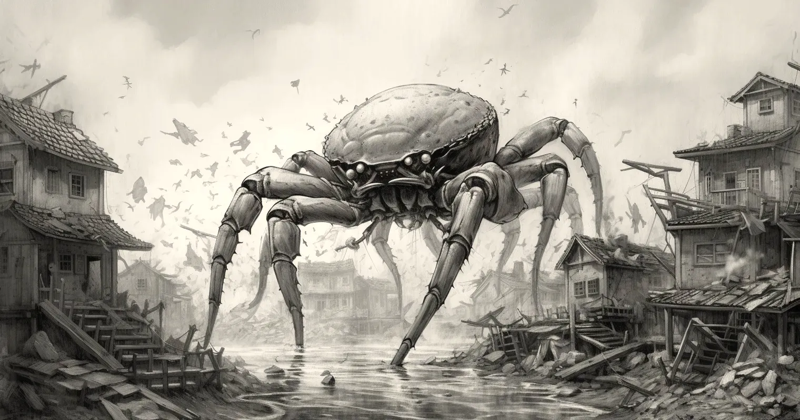

# Rust CLI Tools

A collection of classic BSD command-line tools translated to Rust while assessing the Clap crate for a professional
project. Inspired by Ken Youens-Clark's excellent [Command-Line Rust](https://learning.oreilly.com/library/view/command-line-rust/9781098109424/).

## Tools
- [x] `cat`
- [x] `echo`
- [x] `find`
- [x] `head`
- [x] `uniq`
- [x] `wc`
